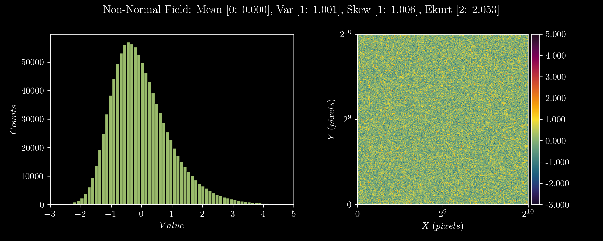

# non-normal
Generate non-normal distributions with given a mean, variance, skewness and kurtosis using
the [Fleishman Method](https://link.springer.com/article/10.1007/BF02293811)



### Installation

Installs cleanly with a single invocation of the standard Python package tool:

```
$ pip install non-normal
```

### Usage

```
from non_normal import fleishman

# Input parameters for non-normal field
mean = 0
var = 1
skew = 1
ekurt = 2
size = 2**20

# Create an instance of the Fleishman class
ff = fleishman.Fleishman(mean=mean, var=var, skew=skew, ekurt=ekurt, size=size)

# Generate the field
ff.gen_field()
non_normal_data = ff.field

# Measure the stats of the generated samples
ff.field_stats

>>> {'mean':    0.000203128504124, 
     'var':     1.001352686678266, 
     'skew':    1.005612915524984, 
     'ekurt':   2.052527629375554,}
```
